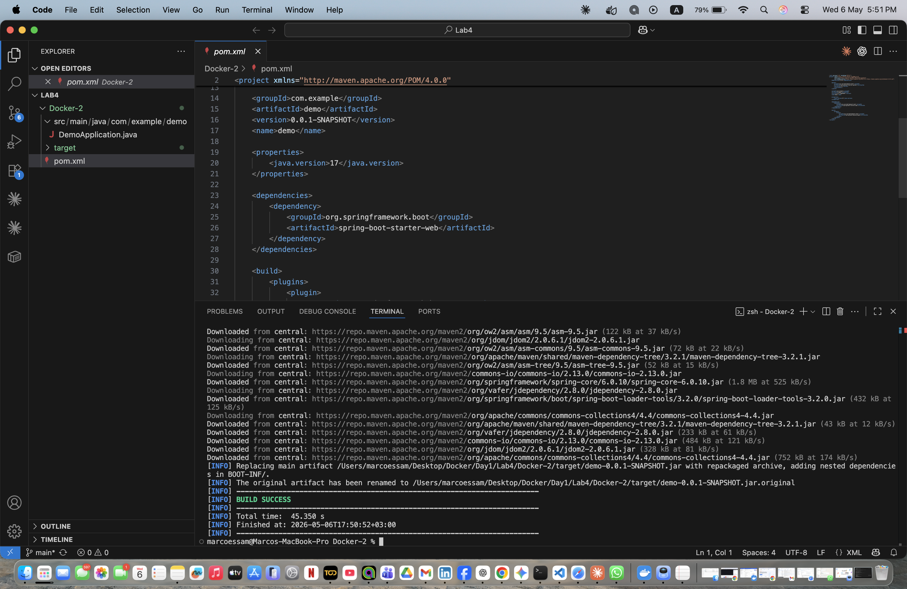
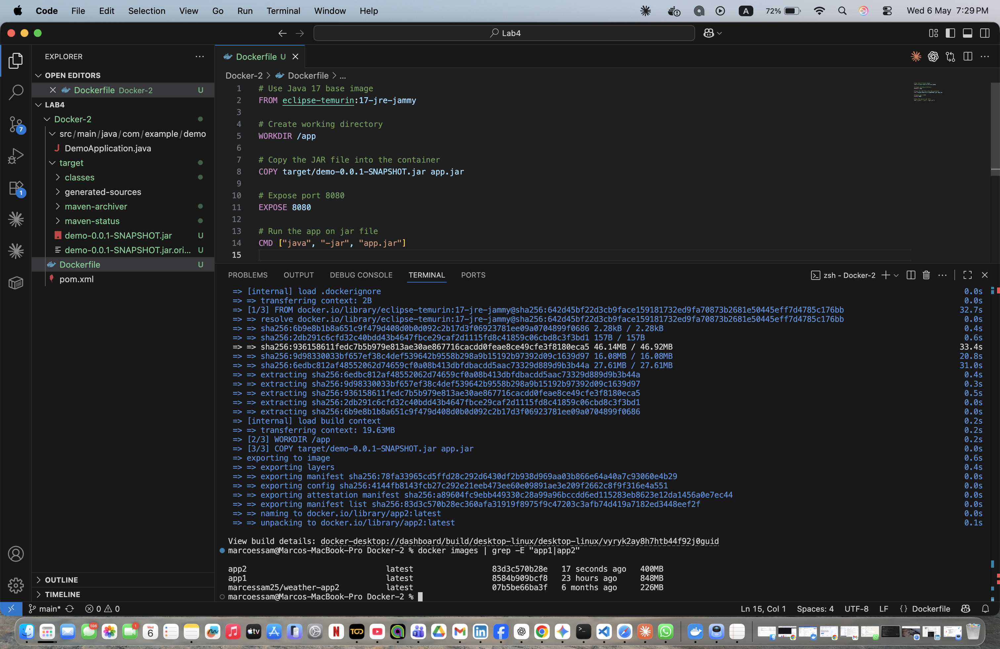
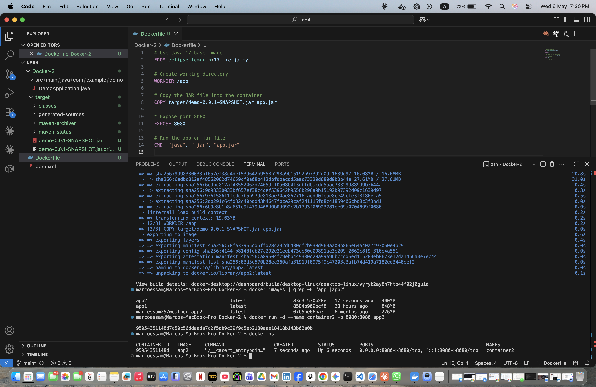
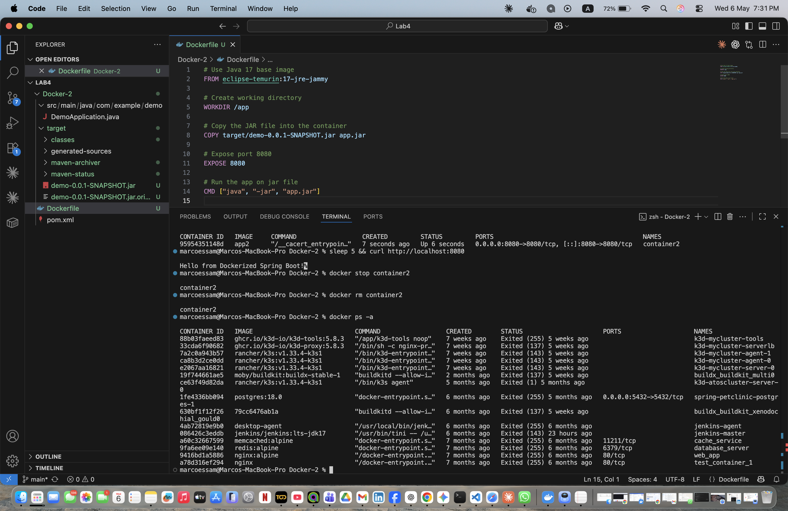

# Lab 4 — Run Java Spring Boot App in a Container (Optimized Image)

## Objective
Build the JAR locally first, then containerize using a lightweight Java 17 image.

## Key Difference from Lab 3
| | Lab 3 | Lab 4 |
|---|---|---|
| Base Image | maven:3.9.6-eclipse-temurin-17 | eclipse-temurin:17-jre-jammy |
| Build location | Inside container | On host machine |
| Image Size | ~500MB+ | ~300MB ✅ Smaller |

## Steps

### 1. Clone the Application Code
```bash
git clone https://github.com/Ibrahim-Adel15/Docker-1.git
cd Docker-1
```

### 2. Build the Application on Host
```bash
docker run --rm \
  -v "$(pwd)":/app \
  -w /app \
  maven:3.9.6-eclipse-temurin-17 \
  mvn package -DskipTests
```


### 3. Write the Dockerfile
```dockerfile
# Use Java 17 base image
FROM eclipse-temurin:17-jre-jammy

# Create working directory
WORKDIR /app

# Copy the JAR file into the container
COPY target/demo-0.0.1-SNAPSHOT.jar app.jar

# Expose port 8080
EXPOSE 8080

# Run the app on jar file
CMD ["java", "-jar", "app.jar"]
```

### 4. Build app2 Image
```bash
docker build -t app2 .
docker images | grep -E "app1|app2"
```


### 5. Run container2
```bash
docker run -d --name container2 -p 8080:8080 app2
docker ps
```


### 6. Test the Application
```bash
curl http://localhost:8080
```

### 7. Stop and Delete
```bash
docker stop container2
docker rm container2
docker ps -a
```


## Result
✅ Smaller and more efficient Docker image by pre-building the JAR on the host.
