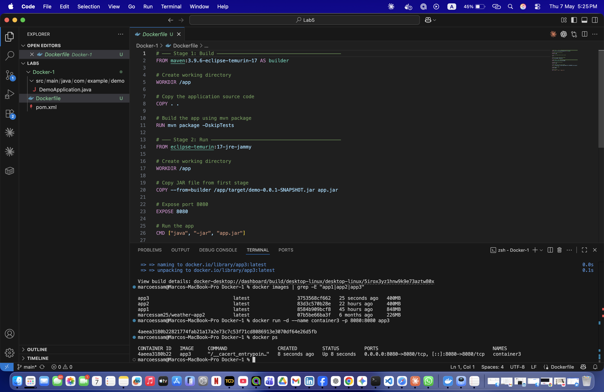
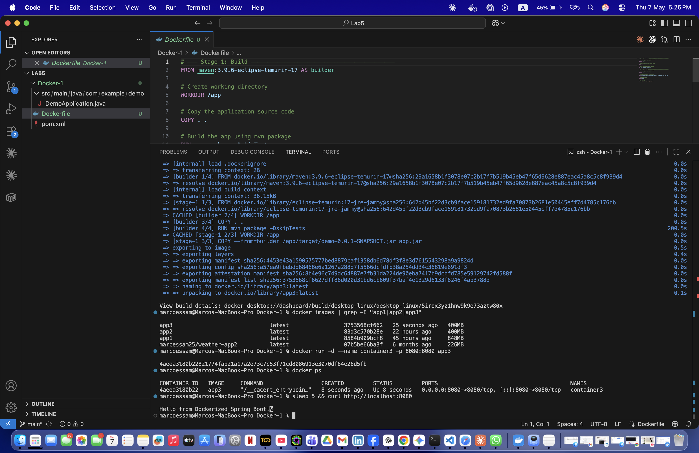
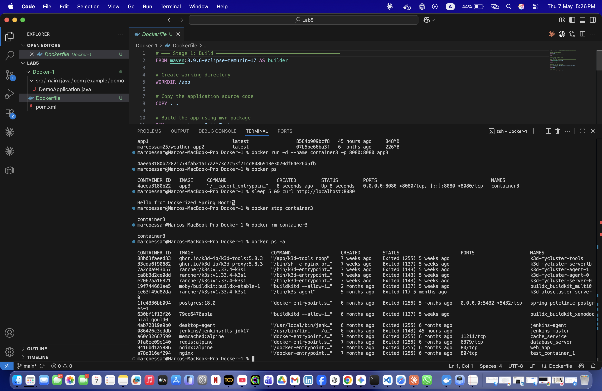

# Lab 5 — Multi-Stage Build for a Java Spring Boot App

## Objective
Use Docker multi-stage build to produce a small, production-ready image without leaving build tools behind.

## Image Size Comparison
| | Lab 3 | Lab 4 | Lab 5 |
|---|---|---|---|
| Base Image | maven:3.9.6-eclipse-temurin-17 | eclipse-temurin:17-jre-jammy | Maven + JRE (multi-stage) |
| Build location | Inside container | On host machine | Inside container (stage 1) |
| Image Size | ~500MB+ | ~300MB | ~300MB ✅ |

## Steps

### 1. Clone the Application Code
```bash
git clone https://github.com/Ibrahim-Adel15/Docker-1.git
cd Docker-1
```

### 2. Write the Multi-Stage Dockerfile
```dockerfile
# ─── Stage 1: Build ───────────────────────────────
FROM maven:3.9.6-eclipse-temurin-17 AS builder
WORKDIR /app
COPY . .
RUN mvn package -DskipTests

# ─── Stage 2: Run ─────────────────────────────────
FROM eclipse-temurin:17-jre-jammy
WORKDIR /app
COPY --from=builder /app/target/demo-0.0.1-SNAPSHOT.jar app.jar
EXPOSE 8080
CMD ["java", "-jar", "app.jar"]
```

### 3. Build app3 Image
```bash
docker build -t app3 .
docker images | grep -E "app1|app2|app3"
```


### 4. Run container3
```bash
docker run -d --name container3 -p 8080:8080 app3
docker ps
```

### 5. Test the Application
```bash
curl http://localhost:8080
```


### 6. Stop and Delete
```bash
docker stop container3
docker rm container3
docker ps -a
```


## Result
✅ Multi-stage build produces a lean image — build tools stay in stage 1 and never make it into the final image.
