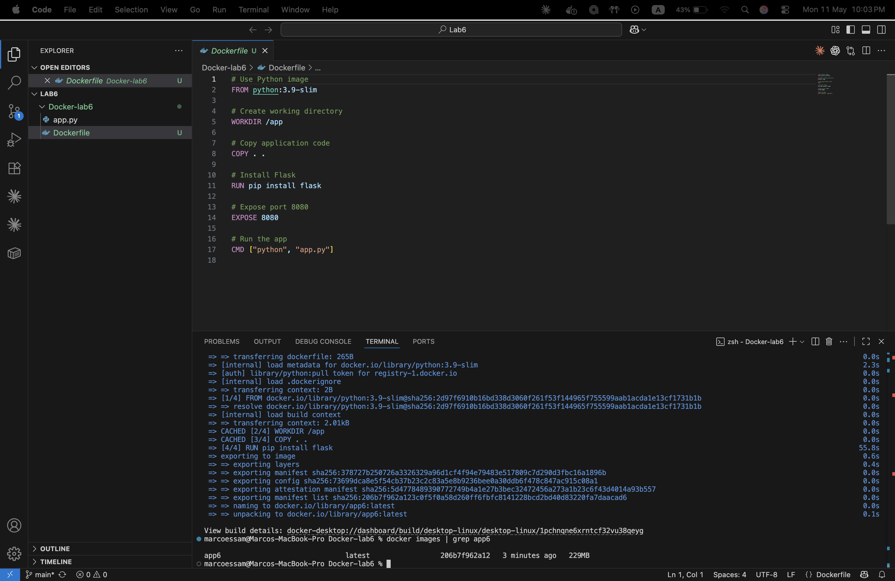
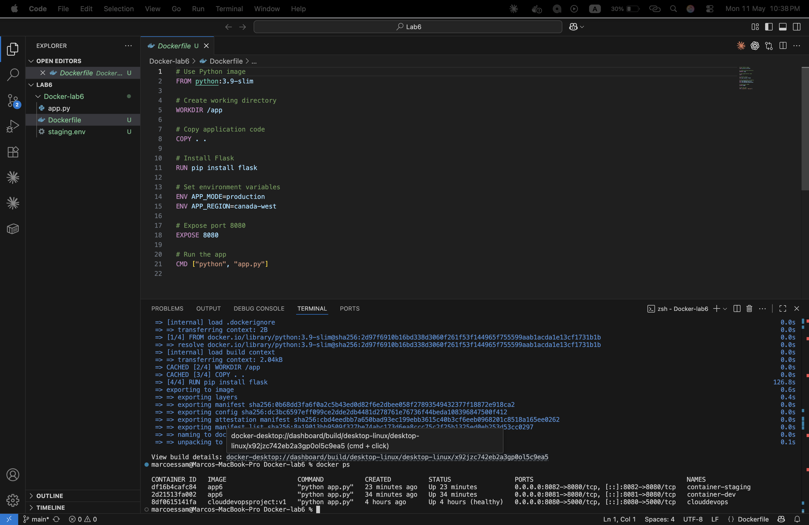
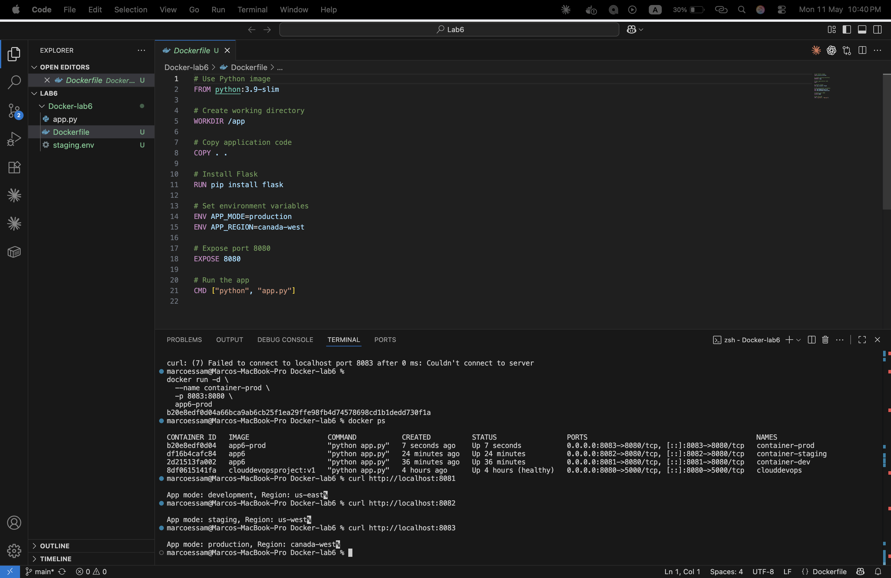
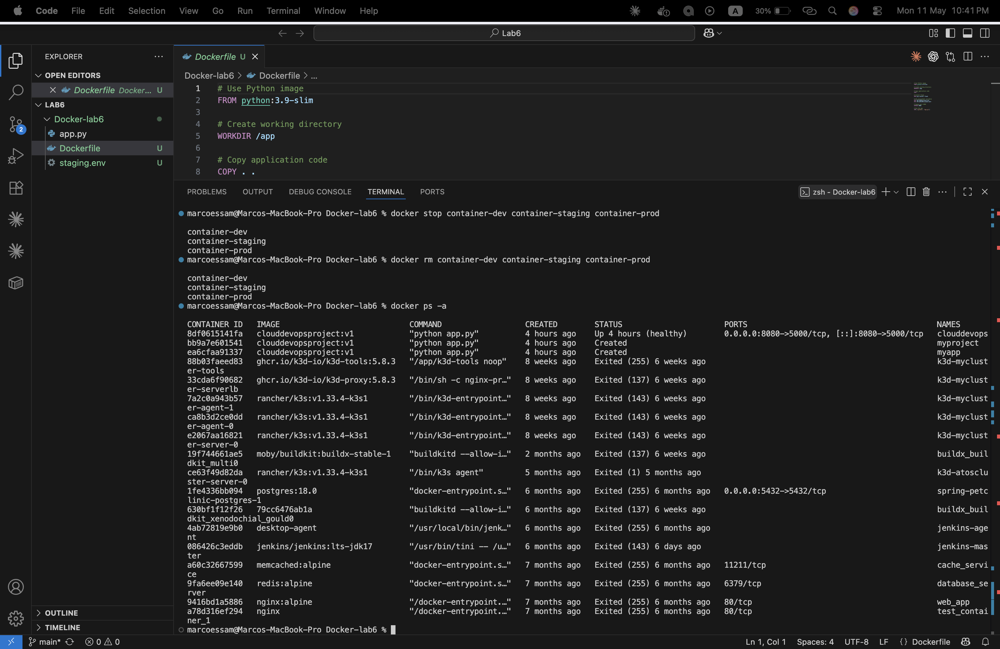

# Lab 6 — Managing Docker Environment Variables

## Objective
Pass environment variables to Docker containers using 3 different methods.

## Methods Comparison
| Method | Container | APP_MODE | APP_REGION |
|--------|-----------|----------|------------|
| `-e` flag in command | container-dev | development | us-east |
| `--env-file` flag | container-staging | staging | us-west |
| `ENV` in Dockerfile | container-prod | production | canada-west |

## Steps

### 1. Clone the Application Code
```bash
git clone https://github.com/Ibrahim-Adel15/Docker-3.git
cd Docker-3
```

### 2. Write the Dockerfile
```dockerfile
FROM python:3.9-slim
WORKDIR /app
COPY . .
RUN pip install flask
EXPOSE 8080
CMD ["python", "app.py"]
```

### 3. Build Docker Image
```bash
docker build -t app6 .
docker images | grep app6
```


### 4. Run 3 Containers

#### i. Variables in command
```bash
docker run -d --name container-dev -p 8081:8080 \
  -e APP_MODE=development \
  -e APP_REGION=us-east \
  app6
```

#### ii. Variables from file (staging.env)
```bash
# staging.env content:
# APP_MODE=staging
# APP_REGION=us-west

docker run -d --name container-staging -p 8082:8080 \
  --env-file staging.env \
  app6
```

#### iii. Variables in Dockerfile
```dockerfile
ENV APP_MODE=production
ENV APP_REGION=canada-west
```
```bash
docker run -d --name container-prod -p 8083:8080 app6-prod
```


### 5. Test
```bash
curl http://localhost:8081
curl http://localhost:8082
curl http://localhost:8083
```


### 6. Stop and Delete
```bash
docker stop container-dev container-staging container-prod
docker rm container-dev container-staging container-prod
```


## Result
✅ Successfully demonstrated 3 methods of passing environment variables to Docker containers.
